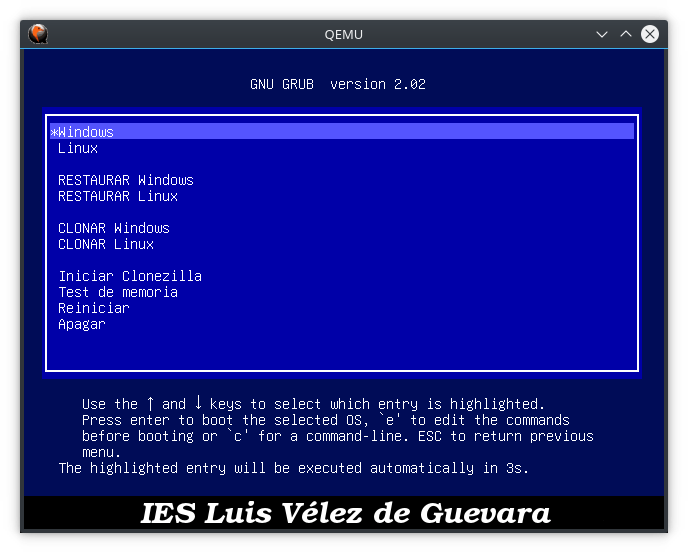

# Instrucciones para instalar Clonezilla en el disco duro

A continuación se muestran los pasos para crear un sistema de restauración/clonación mediante un Clonezilla en una partición de nuestro disco duro. Con dicho Clonezilla instalaremos un GRUB2 personalizado tal cual aparece en la imagen.



## ¿Qué necesitamos?

- Un disco duro con espacio libre para crear 2 particiones:
  - Una de 1 GB para Clonezilla
  - Una de 30 a 50 GB para guardar las imágenes (de Windows y/o Linux)
- [Descargar la versión estable en formato .zip de Clonezilla](http://clonezilla.org/downloads/download.php?branch=stable)
- Archivos para GRUB2.
  - [El archivo de configuración de GRUB2](clonezilla/grub.cfg)
  - [El fondo de pantalla para GRUB2](clonezilla/bg.png)

## Pasos a seguir

1. Iniciar con CDLive/USB. Podemos usar uno de Ubuntu.
2. Crear las 2 particiones si no las hemos creado previamente y formatearlas en ext3/ext4.
3. Montar la partición de 1 GB para Clonezilla en `mnt`.
4. Descomprimir el paquete .zip con los archivos de clonezilla a dicho directorio.
5. Copiar los archivos [`grub.cfg`](clonezilla/grub.cfg) y [`bg.png`](clonezilla/bg.png) a `/mnt/EFI/boot`. 
6. Editar el archivo `/mnt/EFI/boot/grub.cfg` para adaptarlo a nuestras necesidades.
7. Instalar GRUB2 en el disco duro. Para ello abrimos un terminal y hacemos:
```bash
sudo  grub-install  /dev/sda  --root-directory=/mnt
```

## Reinstalar GRUB2

Puede suceder que tengamos una partición con Ubuntu u otro linux instalado y que cuando se actualice el kernel también se instale un GRUB actualizado, sobreescribiendo el GRUB que previamente habiamos configurado. Si esto sucede, la solución es fácil:

1. Iniciamos desde Linux. El que tenemos en el disco duro es válido, no hace falta CDLive.
2. Montamos la partición donde teniamos Clonezilla en `mnt`.
3. Y volvemos a ejecutar:
```bash
sudo  grub-install  /dev/sda  --root-directory=/mnt
```

