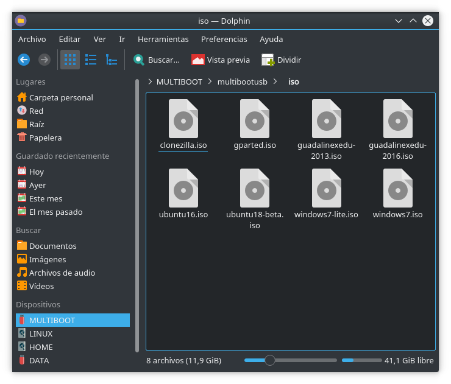

# QEMU

## Inicio de imagenes ISO

```
qemu-system-x86_64 -enable-kvm -machine q35,accel=kvm  -cdrom lubuntu-14.04-desktop-i386.iso -m 2048 -usb -device usb-tablet
```

### Opciones:

- `-enable-kvm -machine q35,accel=kvm`  para mejorar el rendimiento
- `-m 2048`  para reservar memoria RAM (si no indicamos nada puede que la máquina no inicie)
- `-usb -device usb-tablet` para evitar la captura del puntero del ratón por parte de la máquina virtual. Si no establecemos esta opción, deberemos pulsar `Ctrl+Alt` para devolver el puntero del ratón al anfitrión.


## Inicio de USB arrancable

```
qemu-system-x86_64 -enable-kvm -machine q35,accel=kvm  -drive format=raw,file=/dev/sdb,cache=none,if=virtio  -m 2048 -usb -device usb-tablet
```

### Opciones

- `-drive format=raw,file=/dev/sdb,cache=none,if=virtio` formato raw para /dev/sdb (nuestro pendrive arrancable). Sin cache, para poder modificar el contenido del USB y lanzar qemu con los nuevos cambios.


## Referencias 

- https://wiki.archlinux.org/index.php/QEMU 
- https://wiki.gentoo.org/wiki/QEMU/Options


# Como crear un MultiBootUSB personalizado

## Pasos

1. Instala aplicación [MultiBootUSB](http://multibootusb.org/).
2. Introduce un pendrive sin datos, con al menos una partición (suele ser /dev/sdb1)
3. Ejecuta MultiBootUSB e instala el cargador Syslinux en el pendrive.

  

4. Sal de la aplicación MultiBootUSB. A partir de ahora trabajaremos con el contenido del pendrive usando un gestor de archivos y un editor de textos
5. Edita el archivo [/multibootusb/syslinux.cfg](multibootusb/syslinux.cfg).
6. Edita la imagen `/multibootusb/bg.png` a tu gusto (tamaño 640x480 píxeles).

  

7. Copia las imágenes ISO que desees añadir al directorio /multibootusb/iso.

  

8. Edita el [archivo de configuración de GRUB2](multibootusb/grub/grub.cfg).
9. Prueba el resultado en una máquina virtual. Yo he utilizado qemu.

```
qemu-system-x86_64 -enable-kvm -machine q35,accel=kvm -drive format=raw,file=/dev/sdb,cache=none,if=virtio  -m 2048 -usb -device usb-tablet
```

10. A continuación se muestra el proceso para ejecutar la ISO de Windows 7. Los pasos son `Syslinux`->`GRUB2`->`Windows ISO`. 

 
 
 
 
 
 
 
