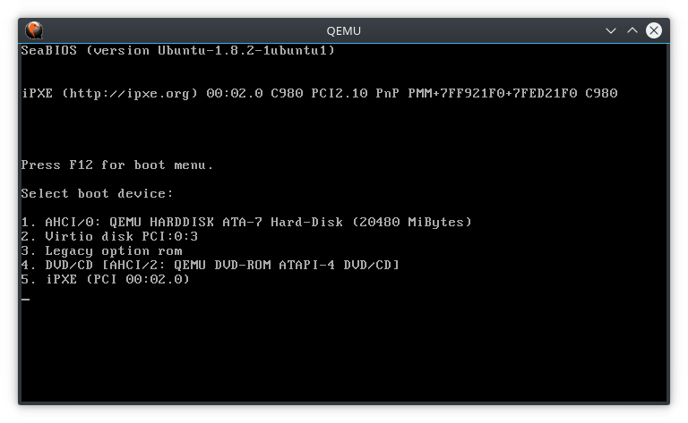

# QEMU

## Inicio de imagenes ISO

```
qemu-system-x86_64 -enable-kvm -machine q35,accel=kvm  -cdrom lubuntu-14.04-desktop-i386.iso -m 2048 -usb -device usb-tablet
```

### Opciones:

- `-enable-kvm -machine q35,accel=kvm`  para mejorar el rendimiento
- `-m 2048`  para reservar memoria RAM (si no indicamos nada puede que la máquina no inicie)
- `-usb -device usb-tablet` para evitar la captura del puntero del ratón por parte de la máquina virtual. Si no establecemos esta opción, deberemos pulsar `Ctrl+Alt` para devolver el puntero del ratón al anfitrión.

En lugar de una ISO, también es posible realizar el inicio desde un CD o DVD físico usando alguna de las siguientes opciones:

- `-cdrom  /dev/cdrom` 
- `-cdrom  /dev/dvd`
- `-cdrom  /dev/sr0`

## Inicio de USB arrancable

```
qemu-system-x86_64 -enable-kvm -machine q35,accel=kvm  -drive format=raw,file=/dev/sdb,cache=none,if=virtio  -m 2048 -usb -device usb-tablet
```

### Opciones

- `-drive format=raw,file=/dev/sdb,cache=none,if=virtio` formato raw para /dev/sdb (nuestro pendrive arrancable). Sin cache, para poder modificar el contenido del USB y lanzar qemu con los nuevos cambios.


## Instalación de sistemas operativos desde ISO o USB arrancable

Para simular las instalación desde una ISO o un USB arrancable necesitaremos un disco duro. En este caso crearemos un disco duro con formato `qcow2`, aunque qemu admite muchos otros formatos (ver referencias) incluidos `vdi` y `vmdk`, compatibles con VirtualBox y VMWare.

```
qemu-img create  -f  qcow2  disco.img  20G
```

Ahora solo tenemos que realizar el inicio desde ISO o USB que pusimos al principio y añadir la opción `-hda  disco.img`. Se pueden añadir hasta 4 discos duros con `-hdb  ...`, `-hdc  ...` y `-hdd  ...`.

Por ejemplo para iniciar desde USB arrancable con disco duro virtual:

```
qemu-system-x86_64 -boot menu=on -hda disco.img -enable-kvm -machine q35,accel=kvm  -drive format=raw,file=/dev/sdb,cache=none,if=virtio  -m 2048 -usb -device usb-tablet
```

La opción `-boot menu=on` nos muestra un menu de inicio al pulsar `F12`y evita que inicie desde `-hda`. Debemos seleccionar `2. Virtio disk ...`.




Con esto ya tenemos un entorno completamente funcional para realizar pruebas de la forma más parecida a un entorno real.

## Scripts

Para ahorrar tener que escribir una sentencia tan larga en la shell, a continuación tienes 2 scripts que facilitan la ejecución de máquinas virtuales. Puedes copiarlos a un directorio que esté dentro del $PATH, por ejemplo `/bin`.

- [run-iso](scripts/run-iso)
- [run-usb](scripts/run-usb)


## Referencias 

- https://qemu.weilnetz.de/doc/qemu-doc.html
- https://wiki.archlinux.org/index.php/QEMU
- https://wiki.gentoo.org/wiki/QEMU/Options
- https://en.wikibooks.org/wiki/QEMU/Images

