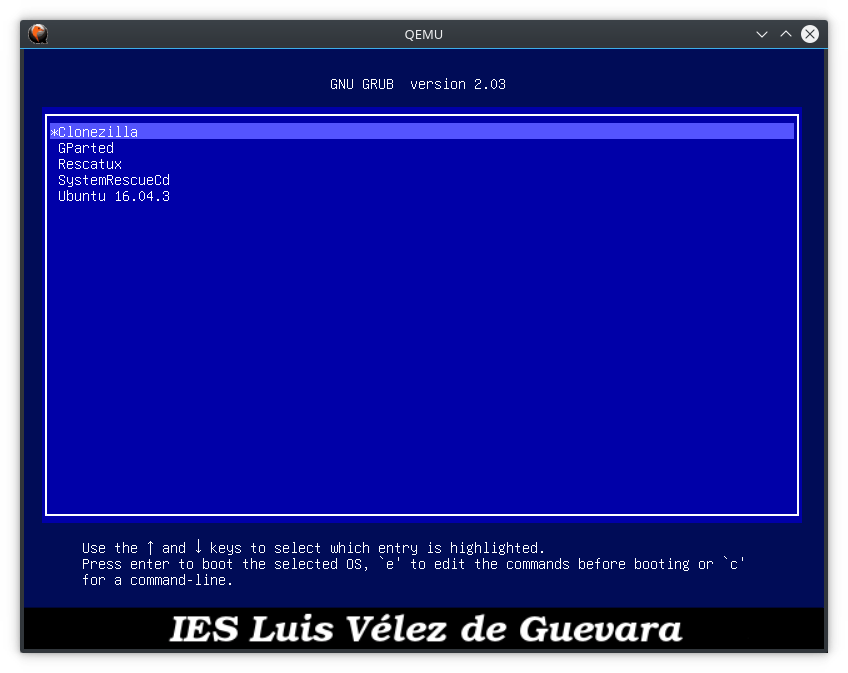

# Como crear un MultiBootUSB personalizado

## Pasos

1. Instala aplicación [MultiBootUSB](http://multibootusb.org/).
2. Introduce un pendrive sin datos, con al menos una partición (suele ser /dev/sdb1)
3. Ejecuta MultiBootUSB e instala el cargador Syslinux en el pendrive.

  

IMPORTANTE: Este paso debería crear las 2 carpetas siguientes con múltiples archivos dentro:
```
EFI/*
multibootusb/*
```
A mí no me ha funcionado, así que un truco es pulsar en la pestaña `MultiBootUSB` y luego instalar una distro de poco peso, por ejemplo la iso de clonezilla. Para ello seleccionamos la imagen .iso y pulsamos en `Install distro` y esperamos un ratito.

 

Una vez finalizado, comprobamos que nos ha creado las carpetas anteriores. También nos habrá creado una carpeta `/multibootusb/clonezilla`. Para liberar este espacio, es aconsejable desinstalar la distro previamente instalada pulsando en el botón `Uninstall distro`. Es una técnica un poco tonta pero consigue lo que queremos. Si no se elimina la carpeta `/multibootusb/clonezilla` entonces lo haremos a mano.


4. Sal de la aplicación MultiBootUSB. A partir de ahora trabajaremos con el contenido del pendrive usando un gestor de archivos y un editor de textos
5. Edita el archivo [/multibootusb/syslinux.cfg](multibootusb/syslinux.cfg).
6. Edita la imagen `/multibootusb/bg.png` a tu gusto (tamaño 640x480 píxeles).

  

7. Copia las imágenes ISO que desees añadir al directorio /multibootusb/iso.

  

8. Edita el [archivo de configuración de GRUB2](multibootusb/grub/grub.cfg).
9. Prueba el resultado en una máquina virtual. Yo he utilizado qemu.

```
qemu-system-x86_64 -enable-kvm -machine q35,accel=kvm -drive format=raw,file=/dev/sdb,cache=none,if=virtio  -m 2048 -usb -device usb-tablet
```

10. A continuación se muestra el proceso para ejecutar la ISO de Clonezilla. Los pasos son `Syslinux`->`Iniciar GRUB2`->`Clonezilla`. 

 
 
 
 
 
 
11. En caso de tener instalado en disco duro el sistema de recuperación Clonezilla podemos acceder a él mediante `Syslinux`->`Iniciar desde Disco Duro`. [Instrucciones para instalar Clonezilla en disco duro](CLONEZILLA.md).

 
 
 

